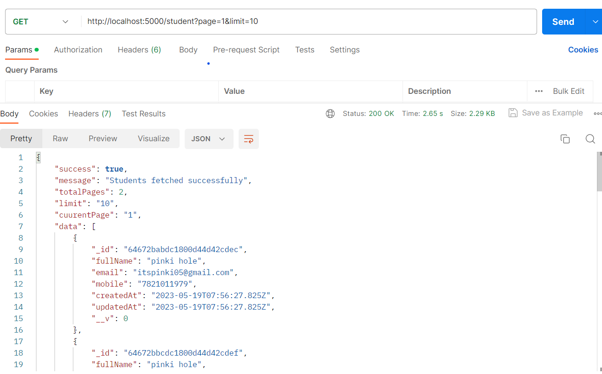
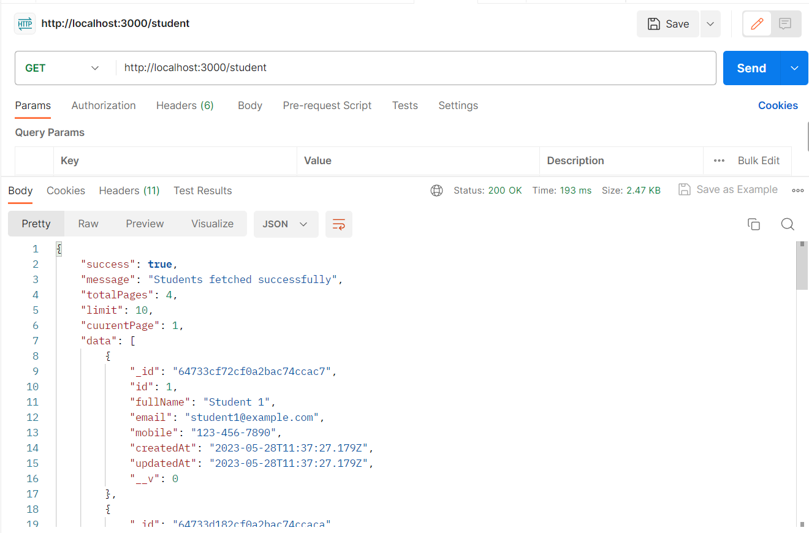
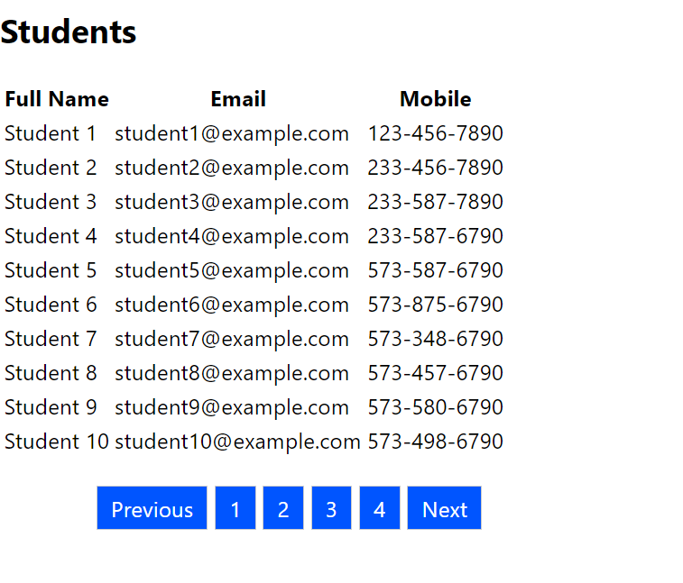

# Express Pagination with MongoDB

This project demonstrates how to implement pagination in an Express.js application using MongoDB as the database.

Pagination is a technique used in websites or applications to display a large amount of data in smaller, more manageable chunks. Imagine you have a list of 100 items, and you want to display them on a web page. Instead of showing all 100 items at once, you can split them into pages, with each page containing a subset of the items.

### The main benefits of pagination are:

1. **Improved Performance:** By dividing the data into pages, you can load and display a smaller portion of the data at a time. This reduces the load on the server and improves the page loading speed. Users only need to load the data they are interested in, rather than waiting for the entire dataset to load.

2. **Enhanced User Experience:** Pagination allows users to navigate through the data more easily. Instead of scrolling through a long list or grid, they can simply click on page numbers or navigation buttons to move between different sets of data. This provides a more intuitive and user-friendly experience.

### Pagination typically involves the following elements:

1. **Page Limit:** This refers to the number of items displayed on each page. For example, if the page size is set to 10, each page will display 10 items. The page size can be configured based on the specific requirements of your application.

2. **Page Navigation:** Pagination includes controls that allow users to navigate between pages. These controls often include buttons for the first page, previous page, next page, and last page. Clicking on these buttons loads the corresponding page of data.

3. **Current Page:** To help users understand their current position within the dataset, pagination often includes page indicators. These indicators show the total number of pages available and highlight the current page being viewed. Users can click on specific page numbers to directly navigate to a particular page.

**Output:**

## Conclusion 

By implementing pagination, you can present large datasets in a more organized and manageable way, enhancing the user experience and improving the performance of your application.
